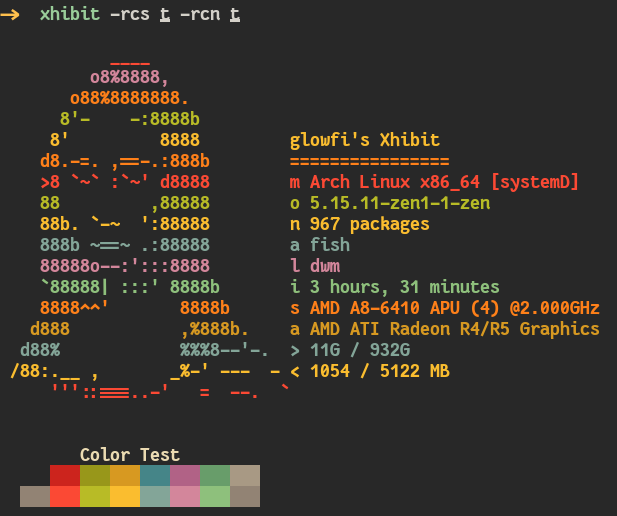

### XHIBIT

> **Exhibit your ASCII ART and system specs**

### INSTALLATION

```
pip install xhibit
```

### HOW TO USE

> Arguments available

```
usage: xhibit [-h] [-cs CS] [-rcs RCS] [-cn CN] [-rcn RCN] [-cpu CPU] [-gpu GPU] [-img IMG]

options:
  -h, --help  show this help message and exit
  -cs CS      Colorscheme to display.
  -rcs RCS    Randomize Colorschemes.
  -cn CN      Specify Character name.
  -rcn RCN    Randomize Characters.
  -cpu CPU    Mention Cpu.
  -gpu GPU    Mention Gpu.
  -img IMG    Mention Image.
```

> Characters available

-   monalisa
-   egyptian
-   casper
-   fairy
-   dragon

> Example commands

> **To Choose gruvbox Colorscheme and casper**

```
xhibit -cs gruvbox -cn casper
```


> **To Choose dracula Colorscheme and fairy**

```
xhibit -cs dracula -cn fairy
```


> **To randomize colorscheme and character**

```
xhibit -rcs t -rcn t
```


