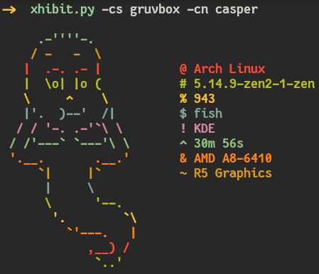
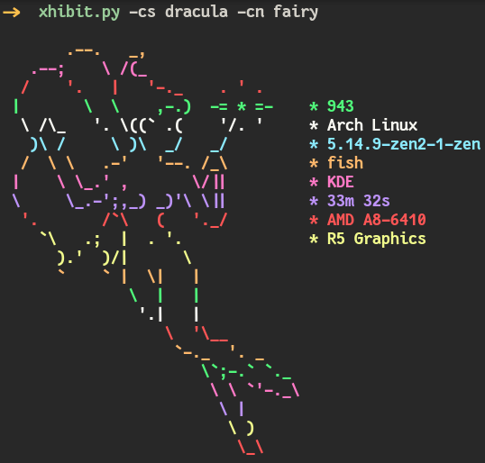
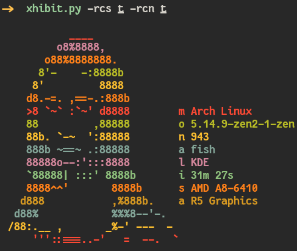

### XHIBIT

> **Exhibit your ASCII ART and system specs (FOR ARCH LINUX USERS ONLY)**

### DEPENDENCIES

```
pip install tcolorpy
sudo pacman -S --noconfirm wmctrl
```

### INSTALLATION

```
git clone https://github.com/glowfi/xhibit
cd xhibit
chmod +x ./xhibit.py
./xhibit.py
```

### HOW TO USE

> Arguments available

```
-cs CS Colorscheme to display (dracula or gruvbox).
-rcs RCS Randomize Colorschemes.(t or f)
-cn CN Specify Character name (dragon,monalisa,casper,egyptian,fairy).
-rcn RCN Randomize Characters.(t or f)
```

> Example commands

> **To Choose gruvbox Colorscheme and casper**

```
xhibit.py -cs gruvbox -cn casper
```



> **To Choose dracula Colorscheme and fairy**

```
xhibit.py -cs dracula -cn fairy
```



> **To randomize colorscheme and character**

```
xhibit.py -rcs t -rcn t
```


