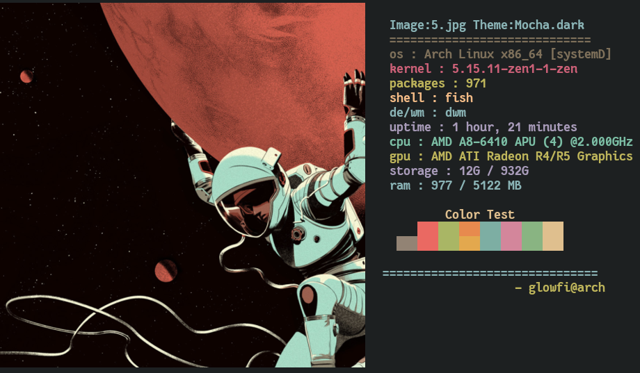

<div align="center">

# 🎨 XHIBIT


**Exhibit your ASCII art and system specs directly in the terminal**


</div>

---

## ✨ Overview

**XHIBIT** is a customizable terminal showcase tool that displays:

- 🖼 ASCII characters
- 🎨 Colorschemes
- 💻 System specifications
- 🖼 Optional image previews

Designed for terminal enthusiasts who want a visually expressive system display.

---

## 🐧 Compatibility

Works on **any Linux-based distribution**.

---

## 🚀 Installation

### 1️⃣ Add local bin to PATH (Required)

#### POSIX shells (bash / zsh / dash)

```bash
echo 'export PATH=$HOME/.local/bin:$PATH' >> ~/.bashrc
```

> Change `.bashrc` to your shell’s rc file if needed.

#### Fish shell

```fish
echo 'set PATH ~/.local/bin $PATH' >> ~/.config/fish/config.fish
```

Restart your shell afterwards.

---

### 2️⃣ Install Package

```bash
pip install xhibit
```

---

## 📦 Dependencies

### ASCII Mode

- Python ≥ 3.5

### Image Display

- kitty terminal **or** ueberzug
- xorg-xdpyinfo
- xdotool
- xorg-xprop
- xorg-xwininfo

---

## 🧠 Usage

```bash
xhibit [options]
```

### Core Options

| Option  | Description                      |
| ------- | -------------------------------- |
| `-v`    | Show version                     |
| `-cs`   | Choose colorscheme               |
| `-rcs`  | Random colorscheme               |
| `-ccs`  | Custom colors (8 hex values)     |
| `-cn`   | Choose ASCII character           |
| `-rcn`  | Random character                 |
| `-cpu`  | Custom CPU name                  |
| `-gpu`  | Custom GPU name                  |
| `-img`  | Display image                    |
| `-imb`  | Image backend (kitty / ueberzug) |
| `-crop` | Image crop mode (fit / fill)     |

---

## 🎭 ASCII Characters

Available characters:

- monalisa
- egyptian
- casper
- fairy
- dragon

---

## 🎨 Colorschemes

- **212 built-in colorschemes**

List all:

```bash
xhibit -lcs all
```

Full list:
[https://raw.githubusercontent.com/glowfi/xhibit-colorschemes/main/colorscheme.txt](https://raw.githubusercontent.com/glowfi/xhibit-colorschemes/main/colorscheme.txt)

---

## 🧪 Examples

### Gruvbox + Casper

```bash
xhibit -cs gruvbox -cn casper
```


---

### Dracula + Fairy

```bash
xhibit -cs dracula -cn fairy
```


---

### Random Everything

```bash
xhibit -rcs t -rcn t
```


---

### Custom Colorscheme

```bash
xhibit -ccs "#BF616A,#A3BE8C,#EBCB8B,#81A1C1,#B48EAD,#88C0D0,#E5E9F0,#B48EAD"
```


---

## 🖼 Image Display

Supports image previews using:

- `kitty` graphics protocol
- `ueberzug`

### Install ueberzug

```bash
git clone https://github.com/ueber-devel/ueberzug
cd ueberzug
pip install .
cd ..
rm -rf ueberzug
```

---

### Display Image

```bash
xhibit -img "path/to/image" -imb kitty
```

or

```bash
xhibit -img "path/to/image" -imb ueberzug
```

---

### Crop Modes

```bash
xhibit -crop fit
xhibit -crop fill
```

---



---

## 🤝 Contributing

Contributions and improvements are welcome.

Small focused PRs preferred.

---

## 📄 License

GPL-3.0
