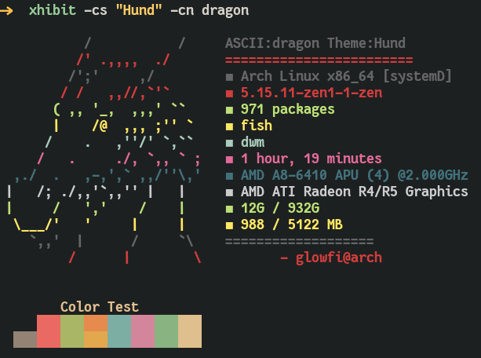

### XHIBIT

> **Exhibit your ASCII art and system specs**

<p align="center">
  
</p>

### This is an alpha software. It requires more testing.

### INSTALLATION

```
pip install xhibit
```

### DEPENDENCIES

**For Ascii art only**

-   **python 3.5+**

**For Image display**

-   **kitty terminal** or **ueberzug**
-   xorg-xdpyinfo
-   xdotool
-   xorg-xprop
-   xorg-xwininfo

### HOW TO USE

```
usage: xhibit [-h] [-cs CS] [-rcs RCS] [-ccs CCS] [-cn CN] [-rcn RCN] [-cpu CPU] [-gpu GPU] [-img IMG] [-imb IMB] [-crop CROP]

options:
  -h, --help  show this help message and exit
  -cs CS      Colorscheme to display.
  -rcs RCS    Randomize Colorschemes [t or f].
  -ccs CCS    Give custom colorschemem of 8 colors like this "#BF616A,#A3BE8C,#EBCB8B,#81A1C1,#B48EAD,#88C0D0,#E5E9F0,#B48EAD".
  -cn CN      Specify Character name [monalisa,egyptian,fairy,casper,dragon].
  -rcn RCN    Randomize Characters [t or f].
  -cpu CPU    Mention Cpu [Custom Cpu name].
  -gpu GPU    Mention Gpu [Custom Gpu name].
  -img IMG    Image path.
  -imb IMB    Mention Image backend [kitty or ueberzug].
  -crop CROP  Mention crop type [fit or fill].
```

### ASCII characters

**ASCII Characters available**

-   monalisa
-   egyptian
-   casper
-   fairy
-   dragon

**Default colorschemes**

-   gruvbox
-   dracula

**Extra Colorscheme List present inside this program**

**[Colorscheme list](https://raw.githubusercontent.com/glowfi/xhibit-colorschemes/main/colorscheme.txt)**

### Example commands

**To Choose gruvbox Colorscheme and casper**

```
xhibit -cs gruvbox -cn casper
```


**To Choose dracula Colorscheme and fairy**

```
xhibit -cs dracula -cn fairy
```


**To randomize colorscheme and character**

```
xhibit -rcs t -rcn t
```


**Pick colorscheme**

Check **[Colorscheme list](https://raw.githubusercontent.com/glowfi/xhibit-colorschemes/main/colorscheme.txt)**

```
xhibit -cs "Eighties.dark" -cn dragon
```



**To give custom user colors**

You can give custom user colors to xhibit to display text.
Must give all the 8 colors in hex format just as shown below.
Nord Colorscheme colors are used below as example.

```
xhibit -ccs "#BF616A,#A3BE8C,#EBCB8B,#81A1C1,#B48EAD,#88C0D0,#E5E9F0,#B48EAD"
```


### DOWNLOAD ALL THE THEMES AND SEE WITH FZF

```
git clone https://github.com/glowfi/xhibit-colorschemes
mv ~/xhibit-colorschemes/themes ~/.cache
rm -rf xhibit-colorschemes
ls ~/.cache/themes| fzf | xargs -I {} cat ~/.cache/themes/{} | xargs | tr " " "," | xargs -I {} xhibit -rcn t  -ccs "{}"
```

### Try all colorscheme in 1 second interval

```
wget https://raw.githubusercontent.com/glowfi/xhibit-colorschemes/main/run.sh -O ~/.cache/xhibitCol.sh
sh ~/.cache/xhibitCol.sh
```

**Image support with ueberzug or kitty terminal.**

```
xhibit -img image_location -imb "kitty"

                or

xhibit -img image_location -imb "ueberzug"

```

**Image crop fit or fill**

```
xhibit -img image_location -imb "kitty" -crop "fit"
xhibit -img image_location -imb "kitty" -crop "fill"

                or

xhibit -img image_location -imb "ueberzug" -crop "fit"
xhibit -img image_location -imb "ueberzug" -crop "fill"

```

## 
