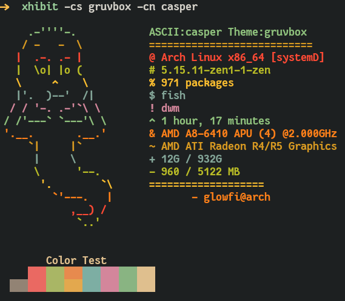

### XHIBIT

> **Exhibit your ASCII ART and system specs**

### INSTALLATION

```
pip install xhibit
```

### DEPENDENCIES

**For Ascii art only**

-   python 3.5+

**For Image display**

-   kitty
-   xorg-xdpyinfo
-   xdotool
-   xorg-xprop
-   xorg-xwininfo

### HOW TO USE

> Arguments available

```
usage: xhibit [-h] [-cs CS] [-rcs RCS] [-cn CN] [-rcn RCN] [-cpu CPU] [-gpu GPU] [-img IMG]

options:
  -h, --help  show this help message and exit
  -cs CS      Colorscheme to display [dracula,gruvbox].
  -rcs RCS    Randomize Colorschemes [t or f].
  -cn CN      Specify Character name [monalisa,egyptian,fairy,casper,dragon].
  -rcn RCN    Randomize Characters [t or f].
  -cpu CPU    Mention Cpu [Custom Cpu name].
  -gpu GPU    Mention Gpu [Custom Gpu name].
  -img IMG    Image path [Image display works for kitty terminal only].
```

> Characters available

-   monalisa
-   egyptian
-   casper
-   fairy
-   dragon

> Example commands

**Image support only on kitty terminal**

```
xhibit -img image_location
```


> **To Choose gruvbox Colorscheme and casper**

```
xhibit -cs gruvbox -cn casper
```



> **To Choose dracula Colorscheme and fairy**

```
xhibit -cs dracula -cn fairy
```


> **To randomize colorscheme and character**

```
xhibit -rcs t -rcn t
```


